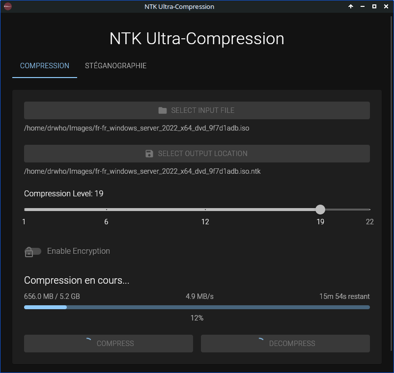
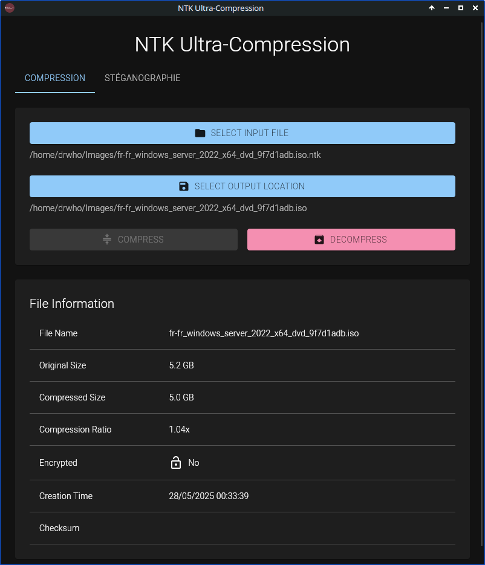
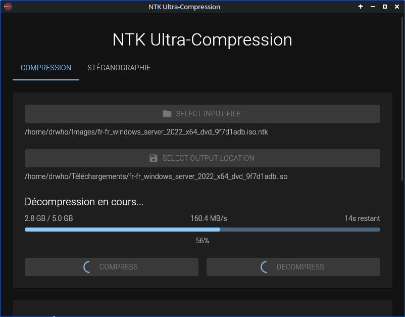
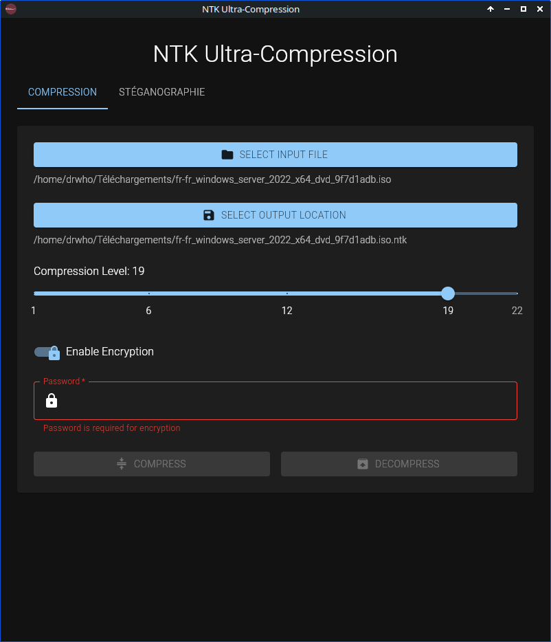
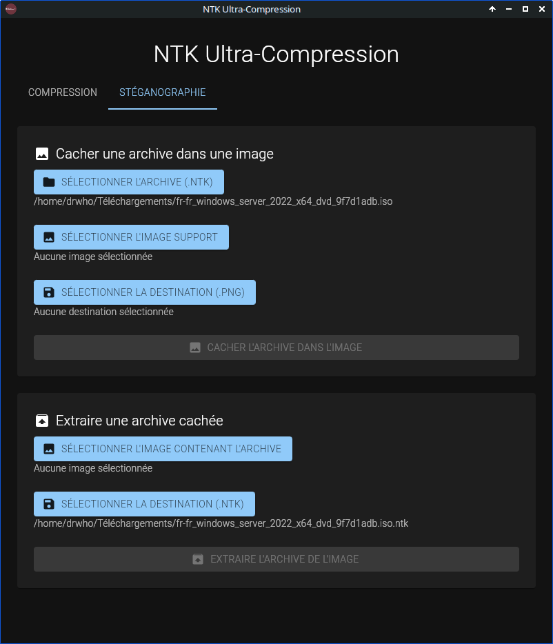

# NTK Ultra-Compression

Un logiciel de compression ultra-performant avec chiffrement et stéganographie.


## Caractéristiques

- **Compression avancée**
  - Utilisation de zstd pour une compression optimale
  - Taux de compression ajustable (1-22)
  - Traitement par blocs pour une meilleure performance
  - Support des fichiers volumineux

- **Sécurité**
  - Chiffrement AES-256-GCM
  - Dérivation de clé sécurisée avec PBKDF2
  - Protection contre les modifications non autorisées

- **Stéganographie**
  - Dissimulation d'archives dans des images PNG
  - Extraction d'archives cachées
  - Vérification de capacité automatique

- **Interface graphique moderne**
  - Design intuitif et réactif
  - Support du glisser-déposer
  - Barre de progression en temps réel
  - Mode sombre par défaut

## Démonstration

<div style="display: flex; gap: 20px; margin-bottom: 20px;">
  <div style="flex: 1;">
    <h3>Interface principale</h3>
    
  </div>
  <div style="flex: 1;">
    <h3>Informations sur l'archive</h3>
    
  </div>
</div>

<div style="display: flex; gap: 20px; margin-bottom: 20px;">
  <div style="flex: 1;">
    <h3>Progression en temps réel</h3>
    
  </div>
  <div style="flex: 1;">
    <h3>Compression avec chiffrement</h3>
    
  </div>
</div>

<div style="display: flex; justify-content: center; margin-bottom: 20px;">
  <div style="max-width: 400px;">
    <h3>Stéganographie - Extraire/Cacher</h3>
    
  </div>
</div>

## Installation

Consultez le fichier [INSTALL.md](INSTALL.md) pour les instructions détaillées d'installation sur votre système.

## Documentation

- [Guide utilisateur](docs/user-guide.md) - Guide complet d'utilisation
- [Documentation technique](docs/technical/README.md) - Documentation pour les développeurs
- [Sécurité](docs/security.md) - Détails sur les mécanismes de sécurité
- [FAQ](docs/FAQ.md) - Questions fréquemment posées

## Structure du projet

```
ntk-ultra-compression/
├── core/           # Bibliothèque de compression
├── gui/            # Interface graphique Tauri
├── docs/           # Documentation
└── test_files/     # Fichiers de test
```

## Utilisation rapide

1. Lancez l'application
2. Sélectionnez un fichier à compresser
3. Choisissez les options (compression, chiffrement)
4. Cliquez sur "Compress" ou "Decompress"

Pour la stéganographie :
1. Allez dans l'onglet "Stéganographie"
2. Choisissez une archive et une image
3. Utilisez "Cacher" ou "Extraire"

## Contribution

Les contributions sont les bienvenues ! Consultez [CONTRIBUTING.md](docs/CONTRIBUTING.md) pour les directives.

## Licence

Ce projet est sous licence MIT. Voir le fichier [LICENSE](LICENSE) pour plus de détails.

## Auteurs

- Nathan Pelletti (@nathanpel)
- Thomas Demesse (@thomdem)
- Keany Vy Khun (@thisiskeanyvy)
- Litissia Ben Mohand (@litissia28)

## Remerciements

- [Tauri](https://tauri.app/) pour le framework
- [zstd](https://github.com/facebook/zstd) pour l'algorithme de compression
- La communauté Rust pour les bibliothèques utilisées

## Dépôt

[GitHub Repository](https://github.com/thisiskeanyvy/ntk-ultra-compression) 